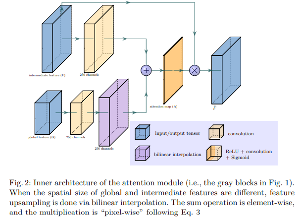
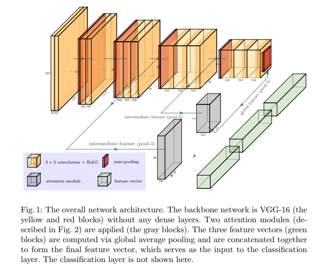

# Cancer Detection using Attention-Based Network
Implemented attention-based deep neural networks for accurate detection of cancer in histopathological images, enhancing model interpretability by focusing on critical regions within tissue samples.

This project implements an **attention-based deep neural network** for **breast cancer detection** using histopathological images. The model improves diagnostic accuracy while enhancing interpretability by focusing on the most relevant tissue regions through attention mechanisms.

## 🧠 Overview

Accurate classification of breast cancer subtypes in histopathology images is a crucial step in computer-aided diagnosis. We leverage attention modules in deep neural networks to enable the model (VGG16) to learn where to focus, helping both improve prediction performance and provide visual explanations for clinical validation.

The model was trained and evaluated on a labeled dataset of histopathological image patches categorized into multiple cancer types.

## 🖼️ Model Architecture

Below are visualizations of the proposed attention-based network architecture:

### 🔍 Inner architecture pf the attention module

### 🧩 The overall network architecture

